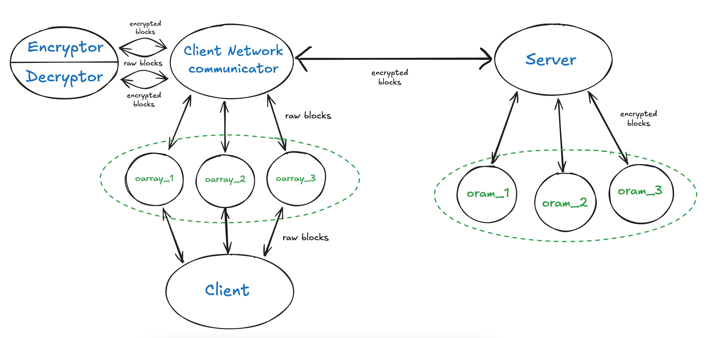

# Path ORAM Implementation

An implementation of (non-recursive) path-oram (https://eprint.iacr.org/2013/280.pdf).

This library provides client-side and server-side components to enable oblivious access to data stored on an untrusted (passively adversarial) server using the Path ORAM scheme.

## Structure

The interconnectivity of components is shown in the diagram below.



## Dependencies

This project requires the following libraries:

*   **CMake:** (Version 3.10 or higher) For building the project.
*   **A C++17 compliant compiler:** (e.g., GCC, Clang)
*   **Boost**
*   **OpenSSL:** For secure communication (specifically libssl and libcrypto).


Make sure the necessary headers and libraries can be found by CMake. The `CMakeLists.txt` file might need adjustments based on your installation paths (e.g., `OPENSSL_ROOT_DIR`).

## Example client usage

```cpp
#include <iostream>

#include "include/oram_lib.hpp"

using namespace oram_lib;
std::vector<unsigned char> encryptor::key;
client_network_communicator cnc;
void o_init()
{
    encryptor::initialize();
    cnc.connect_to_server();
    o_array::init_communicator(cnc);
}

int main()
{
    o_init();

    //write code like you usually would! 
    // (using `o_array <array_name> (n)` in place of `array<int, n> <array_name>`)

    int n;
    std::cin >> n;

    o_array a(n);
    for(int i = 0; i < n; i ++)
        std::cin >> a[i];
    
    o_array prefix_sum_a(n);
    prefix_sum_a[0] = a[0];
    for(int i = 1; i < n; i ++)
        prefix_sum_a[i] = prefix_sum_a[i - 1] + a[i];
    
    for(int i = 0; i < n; i ++)
        std::cout << prefix_sum_a[i] << " ";
    std::cout << std::endl;

    return 0;
}
```